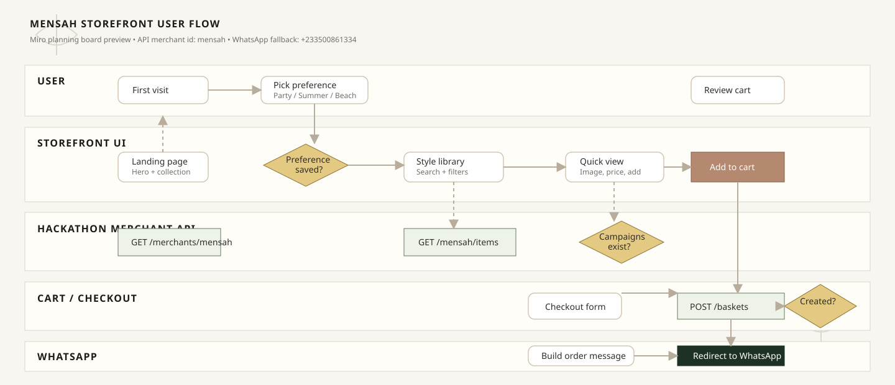

# Mensah — Luxury Tailored Menswear

Hackathon e-commerce platform for the Mensah track, built with Vite, React, TypeScript, and Bun.

## Setup

```bash
bun install
```

## Run

```bash
bun run dev
```

- Vite dev server on `http://localhost:5174`
- API calls proxied to `https://api-hackathon.codedematrixtech.com` via `/api/*`

## Build

```bash
bun run build
```

## Features

- Product catalog fetched from the hackathon merchant API (`mensah` merchant)
- API-backed merchant logo, item photos, prices, and stock status
- Hero section using a Mensah API outfit image
- Product filtering by price range
- Style library search for beach outing, summer, party, program, and Afro-pop looks
- First-visit style preference modal for party, summer, beach vacation, programs, and Afro-pop shoppers
- Product quick-view modal
- Shopping cart (add/remove/adjust quantities)
- WhatsApp checkout flow (`POST /baskets` → WhatsApp redirect with order summary)
- WhatsApp fallback number for Mensah: `+233 50 086 1334`
- Campaign display (when campaigns exist for the merchant)
- Mailing list capture for curated product picks
- Instagram, TikTok, and Google Maps location links
- Mobile responsive design

## Product Flow

Miro board: [Mensah storefront user flow](https://miro.com/app/board/uXjVLjqOV-k=/?moveToWidget=3458764672976345822&cot=14)



## User Flow

1. Visitor lands on the Mensah storefront and sees the hero offer, brand logo, primary API outfit image, and clear calls to shop or read the brand story.
2. On first visit, the style preference modal asks what the visitor is buying for: party, summer, beach vacation, programs, Afro-pop, or all products.
3. The selected preference is saved locally and used to tune the collection view so the shopper starts with more relevant outfits.
4. Visitor browses the collection, searches by occasion terms, and filters by product price range.
5. Visitor opens a product quick view to inspect the API image, price, item details, and add the outfit to cart.
6. Cart opens after add-to-cart, allowing quantity changes, item removal, and checkout.
7. Checkout collects customer name, phone, and order notes.
8. The app creates a basket through the hackathon API and redirects the shopper to WhatsApp with an order summary.
9. If the API merchant record has no WhatsApp number, the storefront falls back to `+233 50 086 1334`.
10. Visitor can also join the mailing list, open social profiles, or view the Google Maps location from the footer.

## Retention Features

- First-visit personalization: asks the shopper what they are buying for and saves the preference for return visits.
- Occasion search: supports high-intent searches such as beach outing, summer dresses, party dresses, programs, and Afro-pop looks.
- Browse-assist modal: after two active browsing minutes with no cart item, asks what the shopper is missing and stores the request locally.
- Cart rescue path: checkout sends the shopper into WhatsApp with a prefilled order summary, reducing drop-off after cart creation.
- Mailing list capture: lets shoppers receive curated product picks and future campaign drops.
- Social and location links: keeps interested shoppers connected through Instagram, TikTok, and Google Maps.
- API-backed visuals: uses Mensah item images directly from the merchant API so the storefront stays aligned with the real catalog.
